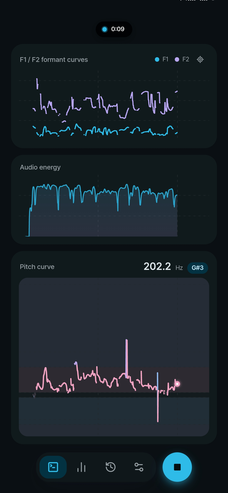
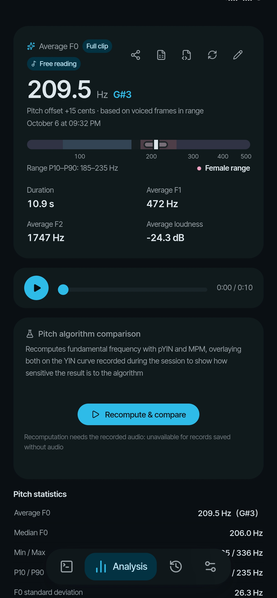
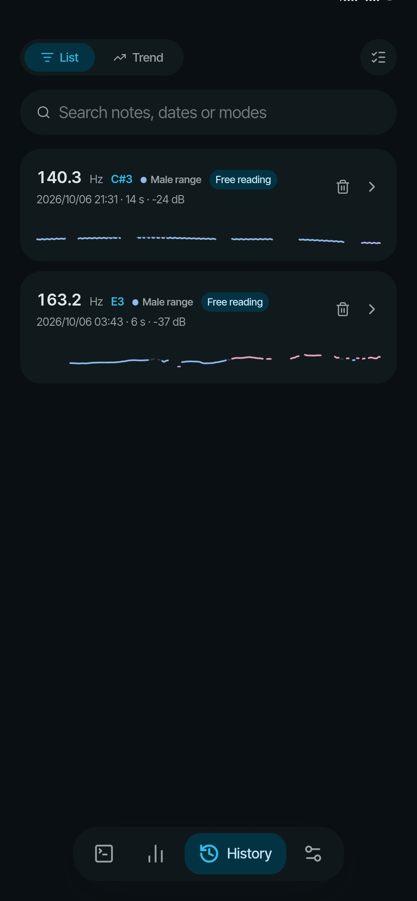
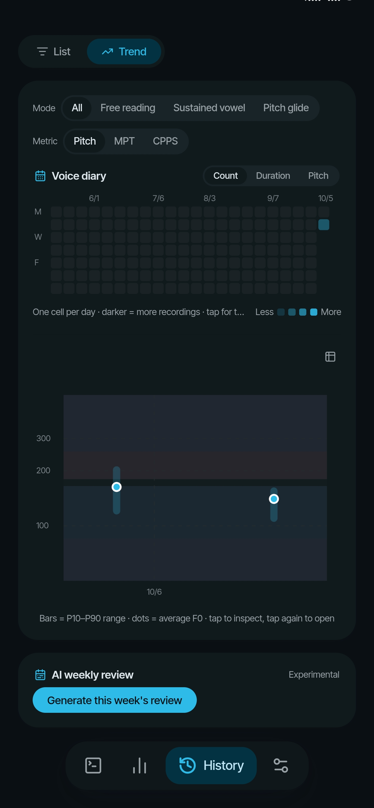
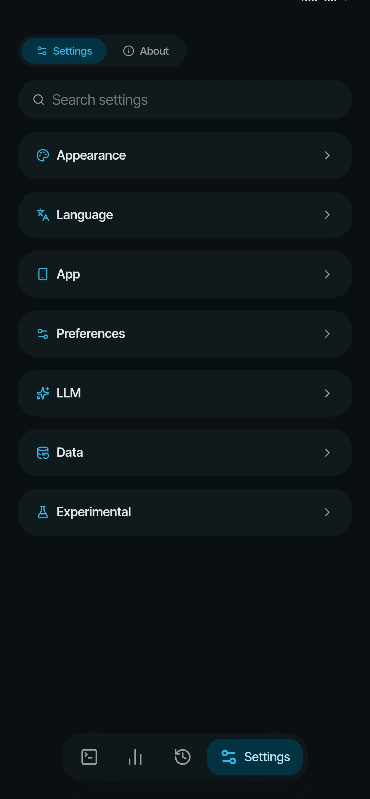

# Simple Voice Tool

English · [简体中文](README.zh-CN.md)

## Project Overview

A voice measurement, analysis and training tracker built on the Web Audio API. Speak into your microphone and get complete curves and statistics for pitch (F0), formants (F1/F2) and energy level — and see where your voice sits within the male and female vocal range bands.

## Get the app

[](https://apps.obtainium.imranr.dev/redirect?r=obtainium%3A%2F%2Fapp%2F%257B%2522id%2522%253A%2522github.com.theforeveriris.simple-voice-tools%2522%252C%2522url%2522%253A%2522https%253A%252F%252Fgithub.com%252Ftheforeveriris%252Fsimple-voice-tools%2522%252C%2522author%2522%253A%2522theforeveriris%2522%252C%2522name%2522%253A%2522simple-voice-tools%2522%257D)

- **Android APK**: grab the latest `SimpleVoiceTool-v*-release.apk` from [GitHub Releases](https://github.com/theforeveriris/simple-voice-tools/releases/latest) and install it directly (release-signed, with in-app update notices)
- **Obtainium**: if you use [Obtainium](https://github.com/ImranR98/Obtainium), tap the badge above to add this repo and pick up new versions automatically
- **PWA**: open the [web version](https://theforeveriris.github.io/simple-voice-tools/) and use "Add to home screen" (offline caching; storage is independent of the APK install)
- **Windows**: grab the latest `SimpleVoiceTool-v*-setup.exe` installer from [GitHub Releases](https://github.com/theforeveriris/simple-voice-tools/releases/latest) (Tauri build; the in-app "check for updates" is not available on desktop)

## Screenshots

| | | |
| --- | --- | --- |
|  |  |  |
| **Testing** — three live charts (F1/F2 formants, audio energy, pitch with voice-range bands) scroll in real time while recording | **Analysis** — overview card with average F0 and range ruler, playback, pitch statistics and the experimental pitch-algorithm comparison | **History** — searchable record list with per-record pitch strips and mode tags |
|  |  | |
| **Trend** — long-term average-F0 chart with P10–P90 bands, a GitHub-style voice-diary heatmap, MPT/CPPS metrics and AI weekly review | **Settings** — searchable settings with sub-pages for appearance, language, app, preferences, LLM, data and experimental features | |

## Features

- **Testing**: three live charts (F1/F2 formants, audio energy, pitch curve) scroll as the recording progresses; the pitch chart is banded by voice range (light purple = out of range, light blue = male, dark = transition, light pink = female), with a live Hz + piano-note readout in the top-right corner
- **Test modes**: short-press the record orb to start recording in the current mode (last choice remembered); long-press for a fan-shaped selector:
  - **Free reading**: read any text aloud — the screen shows only brief prompts, no read-along
  - **Sustained vowel**: hold an "a" — auto-stops after 1 second of silence, paired with Jitter for pitch-stability assessment
  - **Pitch glide**: glide from low to high for 20 seconds to outline your range envelope
- **Analysis**: voice overview card (average F0 + range ruler), four stat tables, four charts (pitch / formants / energy / spectrogram). All charts share one time-axis range — drag the dual sliders to zoom, hold the middle to pan, with **statistics and the range ruler updating live with the selection**; time-series charts support crosshair readouts (hold, or use arrow keys when focused); pitch / energy / formant curves and history trends can all switch to a **data-table view** (real tables, screen-reader friendly, selectable range copyable as TSV); records with saved audio can be **re-analyzed with current algorithm parameters** — the full pipeline reruns and shows old-vs-new stats for confirmation before overwriting, so tuning never requires re-recording (records carry a re-analysis timestamp and parameter fingerprint)
- **Vowel-space scatter**: the formant card toggles between curve and scatter views, plotting all voiced frames on the classic vowel quadrilateral (F1 inverted × F2 inverted, log scale) with /i/ /a/ /u/ reference vowels; the comparison view overlays two records' scatters with centroids marked
- **Formant target zones**: set target F1/F2 centers and a tolerance radius under Settings → Training; the scatter plot (analysis page and live view) overlays the target rectangle and reports hit rates for resonance training
- **Voice range profile (VRP)**: a phonetogram heatmap for glissando recordings — semitones (C2–C6) × loudness (dBFS) matrix with color depth as dwell time, showing range and intensity distribution at a glance
- **Playback**: recorded audio (Opus/AAC) is stored alongside the analysis data in IndexedDB and can be replayed from the analysis page
- **External audio import**: drag phone recordings / voice messages into the app (or share to it) and they run through the same offline analysis pipeline (up to 5 minutes)
- **Pitch algorithm comparison** (experimental): recompute F0 for the same recording with pYIN / MPM, overlaid on the recorded YIN curve, with agreement rate and median deviation
- **Voice quality**: Jitter, Shimmer, HNR and CPPS computed offline from recorded audio (requires "save recordings"); CPPS is robust for continuous speech (free reading) and complements J/S
- **Training targets & baseline**: set a target F0 range (default 165–255 Hz) to overlay a target band on the test-page pitch chart with live deviation and achievement rate; the analysis page reports achievement rate and can auto-compare Δ metrics against a chosen baseline record
- **AI training advice & weekly report** (experimental): plug in your own OpenAI-compatible endpoint to generate per-aspect assessments for one or two records, plus weekly AI reports; streaming output with live preview and cancel; results persist locally (no paid re-calls after restart); endpoints are managed as **profiles** (multiple, one-tap switching, stored in local IndexedDB); token usage is tracked per feature with optional per-million pricing (Settings → **LLM**); only aggregate statistics are sent — never audio or raw curves — and API keys stay in local IndexedDB; every AI request's actual payload is inspectable under Settings → Data → **Data destination** (request log, copyable, clearable); an offline rule-engine advice mode also exists (no connection needed)
- **AI assistant**: a standalone chat page under Settings → LLM — streaming multi-turn conversation; tap a bubble for copy / redo / branch; a right-hand drawer manages history and new chats; the input bar grows with content; context is the conversation itself — no recording data attached automatically
- **History**: records live in IndexedDB (everything is kept; the list shows the latest 200), newest first; toggle List / Trend — the trend view charts average F0 and P10–P90 range over time with **MPT / CPPS** y-axis options and per-mode filtering, plus a GitHub-style voice-diary heatmap; long-press cards (or the multi-select button) for batch deletion and pairwise comparison (delta table + pitch overlay); notes and search supported
- **Practice reminders**: optional daily local notification (fires at the set time when no recording exists that day), custom time supported
- **Settings**: themes (three presets with preview cards — Monet-inspired: hue / accent / dark-hue sliders with duotone and an independent dark base; pride flags: trans / non-binary / gender-fluid with flowing gradient background + frosted-glass components and adjustable intensity / saturation / blur / drift; custom image: the background layer is taken over by an image with focus / blur / dim / saturation / presence / drift controls, compressed and stored locally, packed into ZIP backups; ambient easter eggs — voice tint: the UI hue drifts blue↔pink with live pitch, volume breath: gradient intensity breathes with mic loudness), data import/export (JSON / summary CSV), recording duration limit, microphone selection, save-audio toggle, native splash screen (on by default, toggle under Preferences)
- **Backup**: full backup (ZIP: records + all audio) with one-click restore; storage usage panel (quota / audio size / persistent-storage request); cloud backup — GitHub private repo (Device Flow authorization, writes to your own repo, unchanged files skipped), WebDAV, or local auto-backup via File System Access (experimental); cloud backups support **passphrase encryption** (AES-GCM, encrypted before upload, the passphrase is never stored); the Data settings page opens with a **data-destination** panel that honestly documents where each kind of data goes
- **Export**: one-tap PNG report card (Canvas-drawn, four selectable styles — themed / dark / light / aurora — with the themed style following your live theme colors and every card carrying a QR code to this repo; system share sheet); per-record frame-level CSV; an interactive single-file HTML report; **Praat interop files** (PitchTier pitch curves / per-frame Formant F1-F2 that open directly in Praat for cross-validation)
- **Keyboard shortcuts**: `1–4` switch tabs, `Space` start/stop recording, `M` mode selector, `?` all shortcuts (history `/` focuses search, multi-select `Ctrl/⌘+A`, `Esc` to exit, …)
- **App shortcuts**: long-press the home-screen icon to jump straight to testing / history / settings — manifest shortcuts for installed PWAs, native shortcuts on Android (labels follow system language)
- **Experimental features**: a settings sub-page for capabilities being polished — analysis-page spectrogram toggle, test-page live spectrogram (narrowband magnitude spectrum), rule-based local advice, real-time pitch algorithm switch, algorithm parameters (YIN threshold / pitch search range / voiced & active-frame energy gates / LPC pre-emphasis & order / F1·F2 search windows / voice-quality confidence & minimum periods / CPPS peak search & time smoothing — applied to live and offline analysis alike), and four live practice views (vowel scatter / pitch / spectrum / VRP)
- **In-app documentation**: algorithm principles and developer docs readable offline under Settings → About
- **Languages & dark mode**: English UI by default; built-in 简体中文 / 繁體中文 / English / 日本語 / Literary Chinese (en & ja machine-translated, Literary Chinese is an easter egg), plus "AI translation" (experimental) — translate the UI into any language with an LLM and cache locally; Monet theming supports light / dark / system appearances
- **PWA**: installable to desktop / home screen (Settings → App), Service Worker offline caching, OGP social share card

## Documentation

| Doc | Contents |
| --- | --- |
| [documentation/DEVELOPMENT.md](documentation/DEVELOPMENT.md) | Developer docs: architecture, data flow, theming, motion model, performance design |
| [documentation/ARCHITECTURE-I18N.md](documentation/ARCHITECTURE-I18N.md) | Architecture: i18n lookup chain, custom entries, AI translation pipeline |
| [documentation/ARCHITECTURE-THEME.md](documentation/ARCHITECTURE-THEME.md) | Architecture: theme system, pride-flag presets, gradient parameters |
| [documentation/ARCHITECTURE-STATE.md](documentation/ARCHITECTURE-STATE.md) | Architecture: state & persistence, storage key inventory, migrations |
| [documentation/ARCHITECTURE-SETTINGS.md](documentation/ARCHITECTURE-SETTINGS.md) | Architecture: settings sub-page pattern & how to add one |
| [documentation/GUIDE-PWA.md](documentation/GUIDE-PWA.md) | Guide: PWA update flow, Share Target, repair tool |
| [documentation/GUIDE-CAPACITOR.md](documentation/GUIDE-CAPACITOR.md) | Guide: Capacitor Android shell (build / signing / native share / known limits) |
| [documentation/GUIDE-DESKTOP.md](documentation/GUIDE-DESKTOP.md) | Guide: Tauri Windows desktop (build / CI / platform differences) |
| [documentation/PARAMETERS-GUIDE.md](documentation/PARAMETERS-GUIDE.md) | Metrics & parameters guide: what every number means, defaults, and the experimental algorithm parameters |
| [documentation/ALGORITHM-YIN.md](documentation/ALGORITHM-YIN.md) | Pitch detection: YIN difference function, CMND, parabolic interpolation |
| [documentation/ALGORITHM-FORMANT-LPC.md](documentation/ALGORITHM-FORMANT-LPC.md) | Formant extraction: pre-emphasis, decimation, LPC, polynomial root finding |
| [documentation/ALGORITHM-ENERGY.md](documentation/ALGORITHM-ENERGY.md) | Energy analysis: RMS, decibel conversion, VAD threshold system |
| [documentation/ALGORITHM-CPPS.md](documentation/ALGORITHM-CPPS.md) | CPPS: real cepstrum, regression-line baseline, time smoothing |

> These docs are written in Chinese. They are also readable offline in the app: **Settings → About → Documentation**.

## Tech Stack

- React 19 + TypeScript + Vite
- Tailwind CSS (Monet-style dynamic palette generated in OKLCH color space)
- Zustand (state) + IndexedDB (records & audio persistence)
- Framer Motion (animation)
- Web Audio API + raw Canvas 2D (hand-drawn charts, no chart library):
  - **YIN** pitch detection (difference function + CMND + parabolic interpolation)
  - **LPC** formant extraction (Levinson-Durbin + Durand-Kerner root finding)
  - RMS energy level with VAD gating
  - **Jitter / Shimmer / HNR** voice quality (peak-detected period sequences + YIN confidence)
  - **CPPS** cepstral peak prominence (custom radix-2 FFT → real cepstrum → regression baseline → time-smoothed distribution statistics)
  - **FFT spectrogram** (log-band quantized storage + magma colormapping)
- fflate (ZIP backup packaging); GitHub cloud backup via Device Flow + REST API, zero backend
- Native shells: Capacitor 7 (Android APK) + Tauri 2 (Windows installer); uqr for the share-card QR code

## Development

### Install dependencies

```bash
npm install
```

### Dev mode

```bash
npm run dev
```

### Build

```bash
npm run build
```

### Test

```bash
npm test        # vitest suite (DSP golden fixtures / export / backup / LLM / i18n integrity; also runs in CI)
```

> The build output goes to `docs/` (gitignored, not committed): pushes to `main` are
> built and deployed to GitHub Pages automatically by GitHub Actions (see
> `.github/workflows/deploy.yml`). Source docs live in `documentation/` and are
> unrelated to the build-output `docs/`.

### Preview the build

```bash
npm run preview
```

### Demo data

No microphone needed to explore the analysis page: append `?demo=1` to any page URL,
or use the "load demo data" buttons in the history / analysis / settings pages.

## Usage

1. The app opens on the test page — **short-press** the orb on the right of the bottom bar
   to start recording in the current mode (**long-press** the orb for the fan selector to
   switch between Free reading / Sustained vowel / Pitch glide)
2. Grant microphone access and follow the on-screen prompts
3. Tap the orb again (or hit the mode / settings duration limit) to finish — you land on
   the analysis page automatically
4. Review everything on the History page: switch to "Trend" for long-term charts,
   long-press cards for multi-select, pairwise comparison or batch deletion; the
   analysis page's time axis supports zoom & pan with linked statistics

## Notes

- Uses `getUserMedia`, so it must run on HTTPS or localhost
- Microphone access requires explicit user permission
- All data (analysis records + audio) is stored locally in the browser's IndexedDB by
  default; data only leaves the device when you run a full backup or connect cloud
  backup to a destination you choose
- Voice-quality metrics (Jitter/Shimmer/HNR/CPPS) require "save recordings" to be on;
  older records or audio-free records show "—"
- Detection accuracy depends on the environment — test in a quiet space
- WebDAV backup requires the server to allow cross-origin requests (CORS); some
  services (e.g. Jianguoyun) need extra configuration, see the in-code comments
